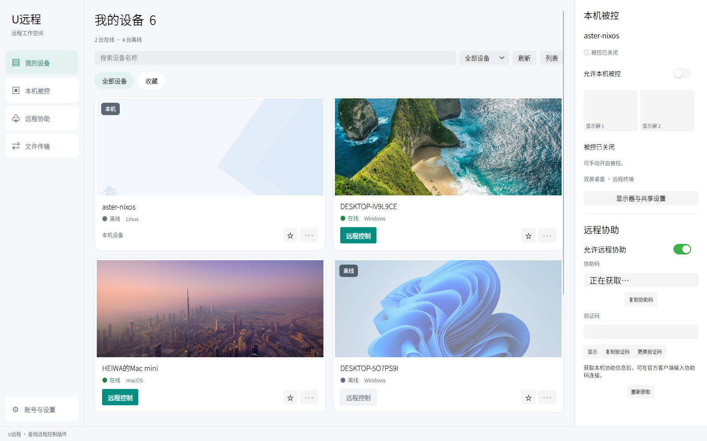
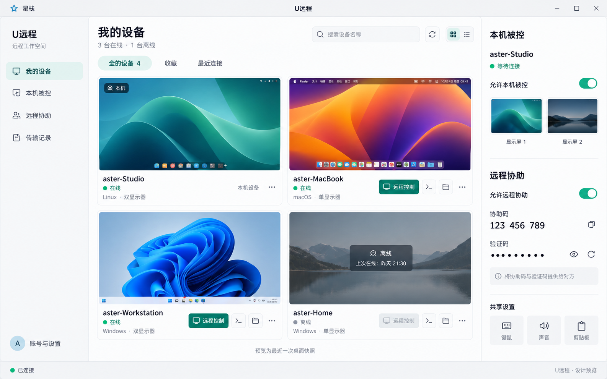

# U远程 · 星栈远程控制插件

U远程是 [星栈（AsterDock）](https://github.com/hdward-dev/asterdock) 的原生轻应用插件，提供设备列表、远程桌面、本机被控、远程终端和文件传输功能。

**本项目是插件，需要在星栈中使用，不提供独立桌面应用。** 此仓库用于维护插件源码；首次使用请先前往星栈项目。

## 界面预览

新版采用左侧导航、设备桌面预览卡片和右侧本机被控／远程协助面板，支持网格与列表切换、搜索、收藏及深浅主题。



上图为已实现界面的验证窗口截图。设备预览读取上传的桌面壁纸，并非实时视频；缺少图片时显示占位提示。截图中的被控开关为验证窗口状态，不代表当前设备服务状态。

<details>
<summary>查看 UI 设计参考图</summary>



设计图中的设备、壁纸和协助码为示例，实际功能及显示以插件为准。

</details>

## 开始使用

1. 前往 [星栈项目首页](https://github.com/hdward-dev/asterdock)，按其说明安装并启动星栈。发布版本可在 [星栈 Releases](https://github.com/hdward-dev/asterdock/releases) 查看。
2. 在星栈的轻应用列表中打开 **U远程**。如果所用版本已包含此插件，无需重复安装。
3. 在插件的“账号与设置”中完成登录，再从“我的设备”发起远程连接，或在“本机被控”中管理共享与控制权限。

插件下载：前往 [U远程 Releases](https://github.com/hdward-dev/uremote/releases/latest)，下载 `AsterDock-App-u-remote.appbundle`，通过星栈的应用包安装入口导入。请勿同时保留同一插件的旧目录副本。源码开发者也可按下方说明构建模块。

## 功能与运行条件

- 设备壁纸预览、网格／列表切换、搜索与收藏；点击预览在独立视窗打开远程桌面。
- 卡片底栏提供文件传输与终端入口。终端支持命令输入和 Ctrl+C，暂不支持全屏终端程序；文件窗口支持目录浏览、单文件上传下载、进度与取消。端口映射、远程开机尚未实现，入口置灰。
- Linux / Wayland 本机被控，包含多屏、键鼠、远程终端及文件传入/取出。
- 本机被控与远程协助开关；本机手动关闭被控的状态会保存。
- 显示器变化及部分网络、采集故障自动重试。

本机被控需要已登录的 Linux Wayland 桌面，支持 wlr-screencopy 和虚拟键鼠协议，以及带 libx264 的 FFmpeg。系统声音需要 PipeWire/pw-cat，文本剪贴板需要 wl-clipboard。Windows/macOS 本机被控后端尚未实现。

声音、剪贴板、跨客户端兼容性及长期稳定性仍需验证。文件接收目录为 `~/Download/uurc`。不提供虚拟显示器，无登录桌面或系统休眠时不保证远控可用。

更多细节见 [功能与验证说明](docs/u-remote.md) 和 [无人值守说明](docs/unattended-linux.md)。无人值守文档中的服务配置描述开发机部署，安装插件不会自动安装系统服务。

## 插件开发

使用 .NET 10 SDK：

```sh
dotnet restore URemote.slnx
dotnet build URemote.slnx -c Release --no-restore -m:1
dotnet run --project tests/URemote.ProtocolChecks -c Release --no-build
```

可执行 `python3 scripts/package.py` 生成 `.appbundle` 和 SHA-256 校验文件，输出位于 `artifacts/release/`。

构建后，将 `src/URemote.Module/bin/Release/net10.0/` 的完整内容放入星栈的 `Apps/URemote/` 目录，保留插件清单、依赖和第三方声明。运行界面需要星栈宿主；仓库中的 CLI 仅用于开发诊断。

| 项目 | 用途 |
| --- | --- |
| `URemote.Core` | 登录、设备、信令及控制协议 |
| `URemote.Linux` | Wayland 采集、输入、PTY 与系统信息 |
| `URemote.Media` | WebRTC、H.264 与系统音频 |
| `URemote.Host` | 会话管理和开发诊断 |
| `URemote.Module` | 星栈轻应用界面与远控窗口 |
| `AsterDock.Contracts` | 星栈插件接口 |
| `tests` | 协议、媒体及集成检查 |

本仓库从星栈提交 `2f71522` 拆出，可独立构建插件。依赖完整星栈宿主的 DesktopCheck 保留在星栈仓库。

## 第三方声明

第三方来源、许可证和依赖使用条件见 [THIRD-PARTY-NOTICES](src/URemote.Module/THIRD-PARTY-NOTICES.md) 及其链接的许可证文件。请随插件保留这些声明。
